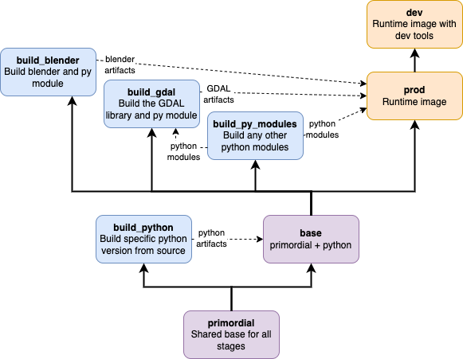

# Contributing

## Development
I use Visual Studio Code with a devcontainer. Install docker and the remote development extension pack from Microsoft, then clone the repo and open the folder. Code should prompt you to reopen in the dev container.

To build the container images, use `make tagged` which uses docker buildx and tries to maximize layer caching/parallelism to speed up the build.

***WARNING:*** Building the container from scratch can take a long time. The blender repos are sometimes very slow to clone for me and can take upwards of 45 min to get all of the code and libraries.

## About the Container Image
The image build is complex because of the way GDAL and Blender work. GDAL doesn't install via pip, it needs to be built from source. The Blender python libraries are very sensitive to python versions and only work with the particular python version built along with that particular Blender version. The current Blender python is 3.10.2, but the ubuntu 20.04 system python is 3.8.10 (22.04 is 3.10.4), and the pre-built GDAL libraries/containers are made with python 3.8. And the ubuntu versions roll regularly. To avoid version conflicts or having multiple separate python runtimes and a subset of scripts dependent on each, our image here builds python 3.10.2 from source, installs it as the system python, and then builds both the GDAL and Blender python modules with that python.

