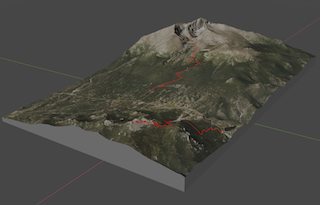
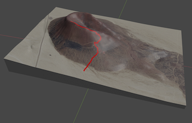
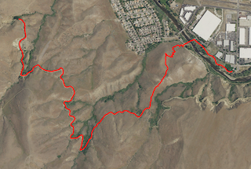
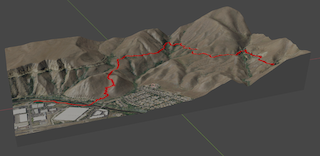
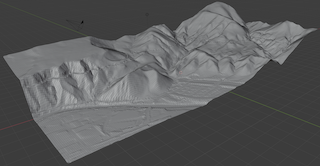

# 3D Terrain Modelling
This tool will create a 3D model in Blender given a set of GPS coordinates. I built this primarily to take a GPX route from a hike or four wheeling trip and create a full color, printable 3D model.
<p align="center">
  
</p>

## Workflow
This is the typical steps that I follow to create a new model.  All of these commands are run inside the container, with a host directory mounted at "work" to hold the input/output files. *Note this is built to work with The National Map, a US resource, so regions outside the US may not be able to automatically download imagery/elevation data.*

Clone the git repo then launch the container:
```
git clone https://github.com/cseelye/terrain-model.git
cd terrain-model
docker container run --rm -it -v $(pwd):/work -w /work ghcr.io/cseelye/terrain-model
```

1. Download and crop the image(s) and preview what the result looks like. Now is a good time to adjust to exactly the coordinates you want the model to cover using the various options to specify the area. Play around with this until you are happy and get the coordinates exactly right.
```
./prepare_image.py --gpx-file work/hitw.gpx \
                   --padding 0.2 \
                   --track-color red \
                   --track-width 10 \
                   --draw-track \
                   --max-height 2048 \
                   --max-width 2048 \
                   --output-file output/hitw.png
```
<p align="center"></p>

2. Download elevation data and create the mesh, using the same coordinates from the previous steps. Try the Z exaggeration if you want to make the features more prominent - sometimes this makes the model more interesting and closer to what it "felt" like in real life in areas without large elevation changes.
```
./build_mesh.py --gpx-file work/hitw.gpx \
                 --padding 0.2 \
                 --z-exaggeration 2 \
                 --mesh-file work/hitw.stl
```
3. Convert the mesh to a blender model, size it to something printable, add thickness, square off the bottom, etc.
```
./create_model.py --mesh-file work/hitw.stl \
                  --min-thickness 0.125 \
                  --size 4.5 \
                  --output work/hitw.blend
```

4. Open the model in blender, UV map the image onto it, export it and upload to [shapeways](https://www.shapeways.com) for printing.
<p align="center"></p>

If you want to really customize the model, stop at step 2, import the stl into your choice of programs and build it out as you wish.
<p align="center"></p>


## Manually Downloading Images/Elevation Data
Download orthoimages from [The National Map](https://apps.nationalmap.gov/downloader)  
1. Select Imagery on the left side
2. Use the map on the right side to search for the area you are trying to model.
3. Click Search Products on the left side.
4. As you hover over the entries on the left, it will highlight the map on the right to show the coverage.
4. Download a many images as you need to cover the area you want to model.
To get elevation data, select "Elevation Products (3DEP)" instead of Imagery.

## Development
See [CONTRIBUTING.md](CONTRIBUTING.md)
